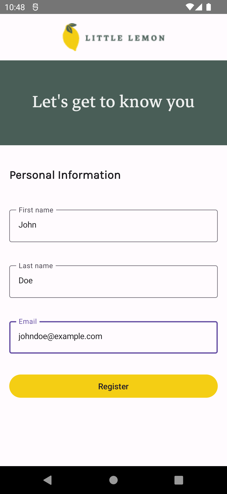
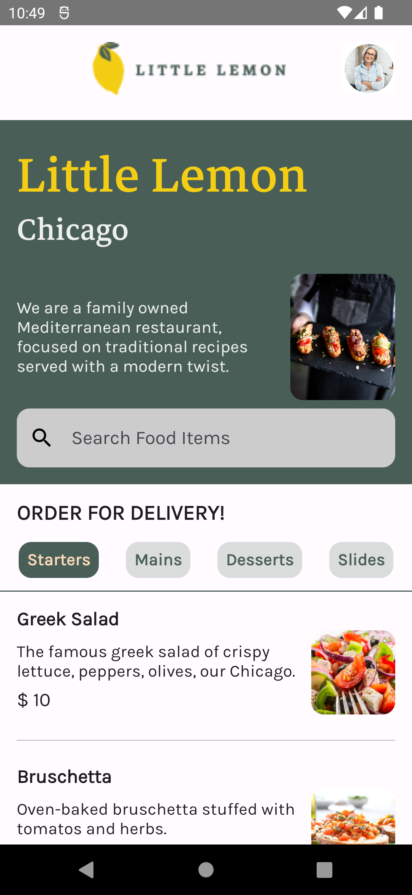
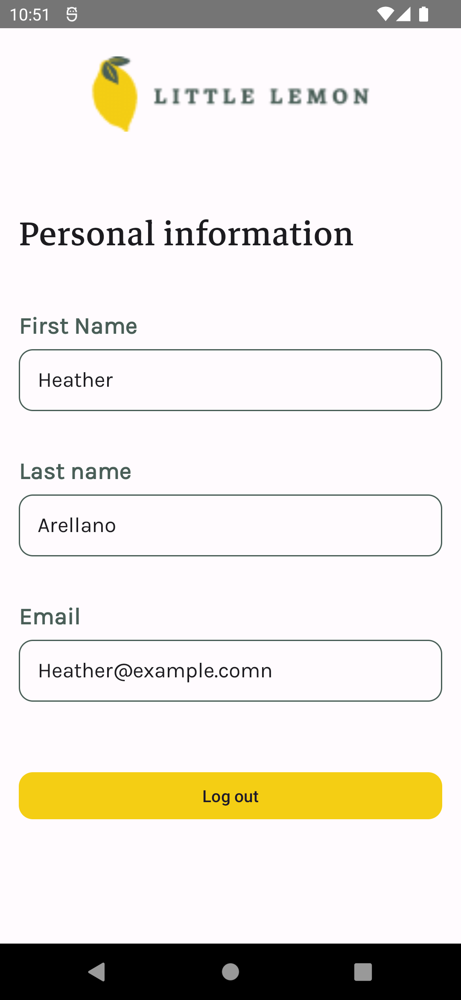

# Little Lemon

Little lemon is the Capstone project for Meta's Android Developer Course on Coursera made in Kotlin.

## Screenshot
| |
|  |  |  |
|---------------------------------------|-----------------------------------|---------------------------------------|